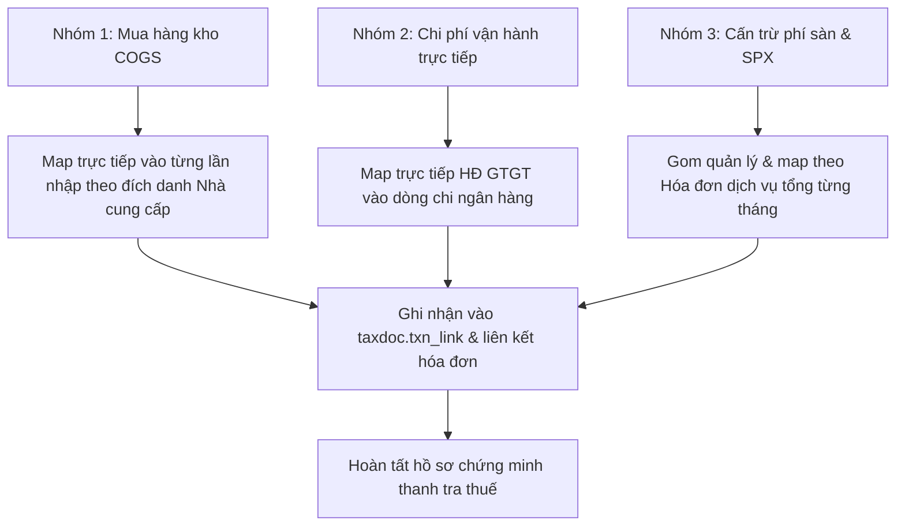

# TÀI LIỆU KIẾN TRÚC DỮ LIỆU & CƠ CHẾ ĐỐI SOÁT (DATA ARCHITECTURE & MAPPING)
## DỰ ÁN 1: TAX & EXPENSE DASHBOARD

---

### 1. Tổng quan Hạ tầng CSDL Supabase

* **Supabase Project Ref:** `ixxrefjiirhdzgwtbcvu`
* **API Endpoint:** `https://ixxrefjiirhdzgwtbcvu.supabase.co`
* **Phân vùng Schema sử dụng:**
  1. `taxdoc`: Quản lý hóa đơn thuế, nhà cung cấp, mirror Lark Base và các view tổng hợp chi phí.
  2. `ar`: Quản lý đối soát sàn TMĐT (Shopee, TikTok), camera Dohana, xuất nhập kho Sapo.
  3. `econtract`: Quản lý hợp đồng điện tử và phiên ký số trực tuyến.

---

### 2. Chi tiết Mô hình Dữ liệu trong Schema `taxdoc`

#### 2.1. Bảng Mirror Lark Base (`taxdoc.mirror_lark`)
Lưu trữ toàn bộ dữ liệu phản chiếu định kỳ từ Lark Base (19,365 bản ghi):
* `F_Bank Transaction` (8,887 dòng): Sao kê ngân hàng (MBBank). Chứa các trường:
  * `Transaction Time` (Timestamp): Thời điểm phát sinh giao dịch.
  * `Debit` (Numeric): Số tiền chi ra.
  * `Transaction Message` (Text): Nội dung ủy nhiệm chi / chuyển khoản.
  * `Supplier` (Text): Tên nhà cung cấp / người nhận tiền.
  * `Category Lv1` / `Category Lv2` (Text): Phân loại chi phí.
  * `Invoice Mapping ID` (Text): Mã liên kết hóa đơn GTGT. Nếu trường này `NULL` $\rightarrow$ Chưa có chứng từ.
* `M_Inventory Log` (9,065 dòng): Phiếu nhập mua nguyên vật liệu, phụ liệu may mặc, bao bì.
* `F_Shipment_Wallet` (671 dòng): Dữ liệu ví đối soát đơn vị vận chuyển SPX Express (cấn trừ COD, phí ship, rút tiền về tài khoản).
* `F_Invoice` (682 dòng): Bảng kê hóa đơn GTGT đã nhận từ nhà cung cấp trên Lark.
* `F_Contract` (60 dòng): Hợp đồng điện tử lịch sử ký qua MISA WeSign.

#### 2.2. Bảng Hóa đơn GTGT Điện tử (`taxdoc.document`)
Quản lý tập trung 475 hóa đơn GTGT đã thu thập:
* `document_id` (UUID): Khóa chính.
* `invoice_key` (Text): Mã định danh duy nhất của hóa đơn (Ví dụ: `MST_KýHiệu_SốHóaĐơn`).
* `series` (Text) & `number` (Text): Ký hiệu (1C26T...) và số hóa đơn.
* `issue_date` (Date): Ngày lập hóa đơn.
* `subtotal` (Numeric): Tiền trước thuế.
* `vat_amount` (Numeric): Tiền thuế GTGT.
* `total` (Numeric): Tổng tiền thanh toán.
* `file_url` (Text): Đường dẫn tải file hóa đơn (PDF/XML).
* `seen_in_gdt` (Boolean): Đã xác thực trên cổng Tổng cục Thuế.

#### 2.3. Bảng Đối tác & Nhà Cung Cấp (`taxdoc.party` & `taxdoc.party_alias`)
* Quản lý 240 nhà cung cấp và 263 quy tắc alias.
* Tự động chuẩn hóa các biến thể tên thợ, tên chuyển khoản viết tắt (Ví dụ: "Trang may", "Chi Trang", "Le Thi Trang" $\rightarrow$ quy về một mã đối tác duy nhất).

#### 2.4. Bảng Liên kết Giao dịch & Chứng từ (`taxdoc.txn_link`)
* Bảng trung gian ghi nhận quan hệ N-N giữa giao dịch chuyển khoản / nhập kho với hóa đơn thuế GTGT hoặc hợp đồng điện tử.

---

### 3. Chi tiết Dữ liệu Đối soát Sàn trong Schema `ar`

#### 3.1. Phân loại Vòng đời Đơn hàng & Hàng hoàn (`ar.v_case`)
View tổng hợp logic đa kênh Shopee/TikTok/Sapo/Dohana:
* `channel`: Kênh bán hàng (`shopee`, `tiktok`).
* `order_id`: Mã đơn hàng.
* `stage`: Giai đoạn hiện tại (`delivered`, `arrived_not_stocked`, `coming_back`, `closed_cash`, `closed_goods`...).
* `substage`: Trạng thái chi tiết phục vụ cảnh báo:
  * `waiting_for_payment`: Đã giao thành công nhưng chưa quyết toán tiền về ví (**129 đơn**).
  * `arrived_no_video` / `filmed_no_stockin`: Hàng hoàn đã về cửa kho nhưng chưa có phiếu nhập Sapo (**23 đơn**).
  * `return_picked_up` / `failed_delivery`: Đơn hoàn đang trên đường vận chuyển quay đầu (**25 đơn**).
* `clock_from` & `age_days`: Đo chính xác số ngày trôi qua kể từ mốc sự kiện.

---

### 4. Thống kê Số liệu Thực tế trên Hệ thống

#### 4.1. Tình Hình Chi Phí vs Chứng Từ Theo Chuẩn Meeting 3 (Năm 2026)

| Nhóm Kế Toán | Bảng Nguồn | Số Dòng | Tổng Số Tiền (VNĐ) | Đã Có Chứng Từ (VNĐ) | Còn Thiếu (VNĐ) | Tỷ Lệ Che Phủ |
|---|---|---|---|---|---|---|
| **1. Mua Hàng Kho (COGS)** | `M_Inventory Log` | 1,886 | 2,579,707,829 | 1,206,985,470 | 1,372,722,359 | 46.8% |
| **2. Chi Phí Trực Tiếp** | `F_Bank Transaction` (`Expense`) | 1,419 | 1,718,724,294 | 0 | 1,718,724,294 | 0.0% |
| **3. Cấn Trừ Sàn & SPX** | `F_Shipment_Wallet` | 403 | 7,259,147 | 0 | 7,259,147 | 0.0% |
| **TỔNG CỘNG 2026** | **3 Nhóm Nghiệp Vụ** | **3,708** | **4,305,691,270** | **1,206,985,470** | **3,098,705,800** | **28.0%** |

*Ghi chú quan trọng:* Đã loại trừ **3.55 tỷ VNĐ** các lệnh trả nợ COGS và luân chuyển vốn nội bộ khỏi sao kê ngân hàng nhằm triệt tiêu hoàn toàn lỗi đếm trùng với sổ kho `M_Inventory Log`.

---

### 5. Kiến Trúc Dữ Liệu Settlement & Cơ Chế Đồng Bộ MISA Batch (Meeting 3)

#### 5.1. Vấn Đề Tắc Nghẽn Cũ
* Trước đây, workflow quét toàn bộ **30.000 dòng settlement** và so khớp với **28.000 dòng MISA** để tìm ra 2.000 dòng chưa xử lý, dẫn đến quá tải bộ nhớ và timeout API mỗi ngày.

#### 5.2. Giải Pháp Gắn Cờ Trực Tiếp Tại Bảng Gốc (`ar.settlements`)
* Thêm trường `misa_booking BOOLEAN DEFAULT false`, `misa_booked_at TIMESTAMPTZ`, `misa_voucher_no TEXT` vào `ar.settlements`.
* Tạo Partial Index `idx_settlements_misa_unbooked` chỉ đánh chỉ mục cho các dòng `WHERE misa_booking IS NOT TRUE`.
* Workflow chạy theo từng lô nhỏ (Batch size: **100, 200, 500 records**). Sau khi hạch toán MISA thành công, cập nhật `misa_booking = true`. Lô tiếp theo chỉ cần quét các dòng chưa có cờ, loại bỏ hoàn toàn việc quét lại 28.000 dòng cũ.

#### 5.3. Bằng Chứng Kỹ Thuật Xác Minh Tính Toàn Vẹn Của ETL (Claude / AI Audit)
1. Cả 2 hàm ETL `ar.parse_shopee_money()` và `ar.parse_tiktok_money()` đều chỉ định tường minh danh sách cột trong lệnh `INSERT INTO ar.settlements (...)`. Do đó, khi thêm cột `misa_booking DEFAULT false`, lệnh INSERT chạy bình thường không phát sinh lỗi số lượng cột.
2. Mệnh đề `ON CONFLICT (channel, txn_id) DO UPDATE` trong ETL chỉ cập nhật duy nhất cột `order_id` khi bị null (`SET order_id = coalesce(...)`). ETL tuyệt đối không đụng vào `misa_booking`, bảo đảm trạng thái đã book MISA không bao giờ bị ghi đè hay mất cờ khi chạy ETL lại.

---

### 6. Cơ Chế Ghép Cặp Theo 3 Nhóm Nghiệp Vụ

