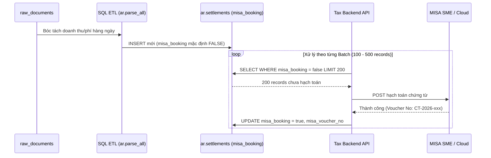

# TÀI LIỆU THIẾT KẾ GIAO DIỆN & LỘ TRÌNH TRIỂN KHAI (SYSTEM DESIGN & ROADMAP)
## DỰ ÁN 1: TAX & EXPENSE DASHBOARD (CHUẨN HÓA SAU MEETING 3)

---

### 1. Triết lý Thiết kế Giao diện (UI/UX Design Philosophy - Meeting 3)

Sau thống nhất tại Meeting 3, giao diện được cấu trúc lại tinh giản tuyệt đối theo tư duy **3-Tier Hierarchical Dashboard** (Phân tầng từ vĩ mô đến hành động chi tiết):
* **Nguyên tắc "Less is More":** Loại bỏ hoàn toàn các thông tin rườm rà, chưa cần thiết ở cấp điều hành (bỏ đơn hoàn, bỏ cảnh báo đơn trễ hạn sàn, bỏ tạm tính rủi ro thuế TNDN 20% vốn gây nhiễu).
* **View 1 (Cấp lãnh đạo - 3 chỉ số cốt lõi):**
  1. **Tổng tiền giao dịch** (Dòng tiền chi ra thực tế - loại trừ lệnh trả nợ và luân chuyển nội bộ).
  2. **Tổng giá trị chứng từ** (Hóa đơn/hợp đồng đã map thành công).
  3. **Chênh lệch thiếu** (Số tiền chưa có chứng từ hợp lệ chứng minh).
* **View 2 (Cấp quản lý - Phân bổ 3 nhóm dòng tiền):**
  - **Nhóm 1:** Mua hàng / Tiền kho (COGS).
  - **Nhóm 2:** Chi phí vận hành ngân hàng trực tiếp (`lv1 = 'Expense'`).
  - **Nhóm 3:** Chi phí dịch vụ sàn & vận chuyển (Shopee, TikTok, SPX).
* **View 3 (Cấp thực thi / Action Hub):** Drill-down trực tiếp xuống:
  - Danh sách từng Nhà cung cấp (đích danh ai nợ hóa đơn: anh Huỳnh, anh Phương, chị Hoa...).
  - Danh sách chi phí vận hành trực tiếp chưa có hóa đơn.
  - Hóa đơn tổng theo tháng của sàn TMĐT & đơn vị vận chuyển.
  - Đồng bộ lô MISA (Batch Sync 100 - 500 records).

---

### 2. Cấu trúc Giao diện Phân tầng (3-Tier Wireframe Layout)

```
+-----------------------------------------------------------------------------------------+
| [LOGO ONESIE]  TAX & EXPENSE DASHBOARD (MEETING 3)                 [ Năm: 2026 v ] [⚙️]  |
+-----------------------------------------------------------------------------------------+
| VIEW 1: BA CHỈ SỐ CỐT LÕI (CORE METRICS)                                                |
| +-------------------------+  +-------------------------+  +---------------------------+ |
| | 💳 TỔNG TIỀN CHI RA     |  | 🛡️ CÓ CHỨNG TỪ HỢP LỆ   |  | 🚨 CHÊNH LỆCH THIẾU       | |
| | 4,305,691,270 VNĐ       |  | 1,206,985,470 VNĐ       |  | 3,098,705,800 VNĐ         | |
| | (Thực tế trừ cấn trừ nợ)|  | (Tỷ lệ che phủ: 28.0%)  |  | (Cần đòi bổ sung gấp)     | |
| +-------------------------+  +-------------------------+  +---------------------------+ |
+-----------------------------------------------------------------------------------------+
| VIEW 2: PHÂN CẤP 3 NHÓM DÒNG TIỀN (DRILL-DOWN THEO BẢN CHẤT NGHIỆP VỤ)                  |
| +-----------------------------+  +-----------------------------+  +-------------------+ |
| | 🏬 NHÓM 1: MUA HÀNG / KHO   |  | 🏢 NHÓM 2: CHI PHÍ VẬN HÀNH |  | 🌐 NHÓM 3: PHÍ SÀN| |
| | Tổng: 2,579,707,829 VNĐ     |  | Tổng: 1,718,724,294 VNĐ     |  | Tổng: 7,259,147đ  | |
| | Có CT: 1,206,985,470đ (47%) |  | Có CT: 0đ (0.0%)            |  | Có CT: 0đ (0.0%)  | |
| | Thiếu: 1,372,722,359đ       |  | Thiếu: 1,718,724,294đ       |  | Thiếu: 7,259,147đ | |
| +-----------------------------+  +-----------------------------+  +-------------------+ |
+-----------------------------------------------------------------------------------------+
| VIEW 3: BẢNG HÀNH ĐỘNG CHI TIẾT (ACTION HUB)                                            |
| [👥 Đòi HĐ Theo NCC]  [🏢 Chi phí trực tiếp]  [📦 Kho chi tiết]  [🌐 HĐ Tổng Sàn] [⚡ MISA]  |
|                                                                                         |
| +-- TAB 1: DANH SÁCH NHÀ CUNG CẤP CẦN ĐÒI HÓA ĐƠN ------------------------------------+ |
| | Tên Nhà Cung Cấp   | Tổng Nhập       | Đã Có HĐ        | Còn Thiếu       | Hành động| |
| | Xuân Kỷ (Thun)     | 535,463,000đ    | 0đ              | 535,463,000đ    | [Đòi HĐ] | |
| | Cty TNHH SX TM CC  | 239,000,000đ    | 0đ              | 239,000,000đ    | [Đòi HĐ] | |
| | Phạm Phương        | 168,000,000đ    | 0đ              | 168,000,000đ    | [Đòi HĐ] | |
| | Chị Hoa            | 160,000,000đ    | 0đ              | 160,000,000đ    | [Đòi HĐ] | |
| | Quỳnh Lê (Phụ liệu)| 43,100,000đ     | 43,100,000đ     | 0đ (100%)       | [Đủ]     | |
| +-------------------------------------------------------------------------------------+ |
+-----------------------------------------------------------------------------------------+
```

---

### 3. Kiến Trúc Đồng Bộ MISA Bằng Cờ Trạng Thái (MISA Sync Architecture)

#### 3.1. Vấn đề và Giải pháp Flagging
* **Trước tối ưu:** Quét 30.000 dòng settlement, tải 28.000 dòng MISA về so sánh chéo để tìm 2.000 dòng chưa xử lý -> Tắc nghẽn mạng, timeout và quá tải CPU.
* **Sau tối ưu:** Thêm cột `misa_booking boolean DEFAULT false` trên bảng `ar.settlements` kèm Partial Index.
* **Quy trình chạy:**
  1. Backend chỉ truy vấn `WHERE misa_booking = false OR misa_booking IS NULL` theo lô (Batch size: 100 - 500 records).
  2. Gửi lô sang MISA API hoặc xuất file hạch toán.
  3. Đánh dấu `misa_booking = true, misa_booked_at = NOW(), misa_voucher_no = ...` ngay khi thành công.
  4. Lô mới kéo về từ sàn chỉ xử lý các dòng mới, không bao giờ quét lại dòng đã hạch toán.



---

### 4. Lộ trình Triển khai Cuốn chiếu (Updated Roadmap)

| Giai đoạn | Nhiệm vụ | Thời gian | Trạng thái / Kết quả đầu ra |
| :---: | :--- | :---: | :--- |
| **Giai đoạn 1** | **Chuẩn hóa Logic Kế toán & Tối ưu MISA** | **Đã hoàn thành** | - Migration SQL thêm cờ `misa_booking` và partial index.<br/>- Đã loại trừ trùng lặp trả nợ COGS trên sao kê ngân hàng.<br/>- Dashboard 3-Tier chuẩn hóa: View 1 (3 chỉ số), View 2 (3 nhóm), View 3 (Action Hub). |
| **Giai đoạn 2** | **Áp dụng Migration DDL lên Supabase Production** | **Bước tiếp theo** | - Chạy file `migrations/20260909_add_misa_booking_to_settlements.sql` qua Supabase SQL Editor.<br/>- Cập nhật batch worker MISA chạy định kỳ mỗi 30 phút. |
| **Giai đoạn 3** | **Tích hợp E-Contract & Tự động đối soát NCC** | **Tiếp nối** | - Tạo hợp đồng / phụ lục với các NCC thiếu hóa đơn lớn (Xuân Kỷ, Cty CC, Phạm Phương, Chị Hoa).<br/>- Tích hợp cổng ký online mobile không cần OTP. |
| **Giai đoạn 4** | **Bàn giao Kế toán & Giám sát Tự động** | **Giai đoạn cuối** | - Tích hợp phân quyền tài khoản Kế toán thuế / Giám đốc điều hành.<br/>- Thông báo cảnh báo hàng tuần qua Telegram/Lark Bot về số tiền thiếu chứng từ theo từng NCC. |

---

### 5. Danh mục File Tài liệu & Mã Nguồn Cập nhật

1. **`documents/01_BUSINESS_REQUIREMENTS.md`**: Cập nhật logic Meeting 3, loại trừ trả nợ COGS trên ngân hàng, 3 nhóm dòng tiền và 3 chỉ số cốt lõi.
2. **`documents/02_DATA_ARCHITECTURE_AND_MAPPING.md`**: Kiến trúc schema `ar.settlements` gắn cờ `misa_booking`, nguyên tắc bóc tách dữ liệu và chứng minh SQL ETL an toàn 100%.
3. **`documents/03_API_AND_INTEGRATION_SPEC.md`**: Đặc tả API 3 tầng `/api/kpi`, `/api/suppliers`, `/api/missing-docs`, `/api/misa/pending-settlements`, `/api/misa/mark-booked`.
4. **`documents/04_SYSTEM_DESIGN_AND_ROADMAP.md`**: Thiết kế giao diện 3 tầng, kiến trúc đồng bộ lô MISA và lộ trình triển khai chi tiết.
5. **`migrations/20260909_add_misa_booking_to_settlements.sql`**: Script DDL tối ưu hóa bảng settlement.

