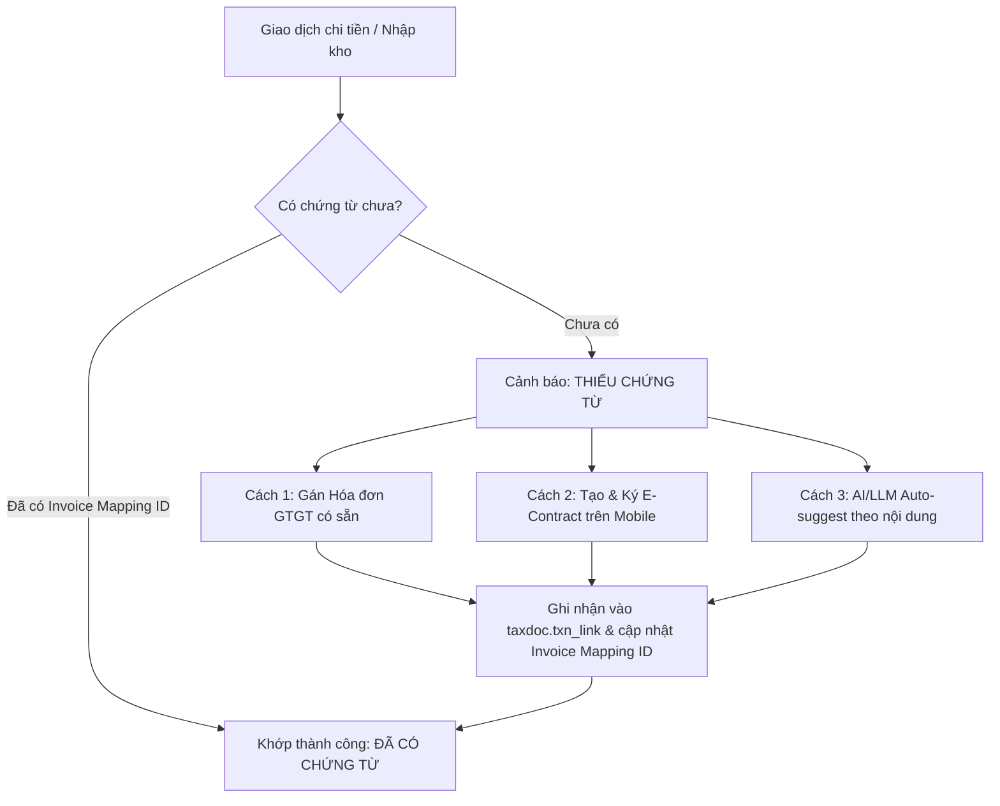

# TÀI LIỆU KIẾN TRÚC DỮ LIỆU & CƠ CHẾ ĐỐI SOÁT (DATA ARCHITECTURE & MAPPING)
## DỰ ÁN 1: TAX & EXPENSE DASHBOARD

---

### 1. Tổng quan Hạ tầng CSDL Supabase

* **Supabase Project Ref:** `ixxrefjiirhdzgwtbcvu`
* **API Endpoint:** `https://ixxrefjiirhdzgwtbcvu.supabase.co`
* **Phân vùng Schema sử dụng:**
  1. `taxdoc`: Quản lý hóa đơn thuế, nhà cung cấp, mirror Lark Base và các view tổng hợp chi phí.
  2. `ar`: Quản lý đối soát sàn TMĐT (Shopee, TikTok), camera Dohana, xuất nhập kho Sapo.
  3. `econtract`: Quản lý hợp đồng điện tử và phiên ký số trực tuyến.

---

### 2. Chi tiết Mô hình Dữ liệu trong Schema `taxdoc`

#### 2.1. Bảng Mirror Lark Base (`taxdoc.mirror_lark`)
Lưu trữ toàn bộ dữ liệu phản chiếu định kỳ từ Lark Base (19,365 bản ghi):
* `F_Bank Transaction` (8,887 dòng): Sao kê ngân hàng (MBBank). Chứa các trường:
  * `Transaction Time` (Timestamp): Thời điểm phát sinh giao dịch.
  * `Debit` (Numeric): Số tiền chi ra.
  * `Transaction Message` (Text): Nội dung ủy nhiệm chi / chuyển khoản.
  * `Supplier` (Text): Tên nhà cung cấp / người nhận tiền.
  * `Category Lv1` / `Category Lv2` (Text): Phân loại chi phí.
  * `Invoice Mapping ID` (Text): Mã liên kết hóa đơn GTGT. Nếu trường này `NULL` $\rightarrow$ Chưa có chứng từ.
* `M_Inventory Log` (9,065 dòng): Phiếu nhập mua nguyên vật liệu, phụ liệu may mặc, bao bì.
* `F_Shipment_Wallet` (671 dòng): Dữ liệu ví đối soát đơn vị vận chuyển SPX Express (cấn trừ COD, phí ship, rút tiền về tài khoản).
* `F_Invoice` (682 dòng): Bảng kê hóa đơn GTGT đã nhận từ nhà cung cấp trên Lark.
* `F_Contract` (60 dòng): Hợp đồng điện tử lịch sử ký qua MISA WeSign.

#### 2.2. Bảng Hóa đơn GTGT Điện tử (`taxdoc.document`)
Quản lý tập trung 475 hóa đơn GTGT đã thu thập:
* `document_id` (UUID): Khóa chính.
* `invoice_key` (Text): Mã định danh duy nhất của hóa đơn (Ví dụ: `MST_KýHiệu_SốHóaĐơn`).
* `series` (Text) & `number` (Text): Ký hiệu (1C26T...) và số hóa đơn.
* `issue_date` (Date): Ngày lập hóa đơn.
* `subtotal` (Numeric): Tiền trước thuế.
* `vat_amount` (Numeric): Tiền thuế GTGT.
* `total` (Numeric): Tổng tiền thanh toán.
* `file_url` (Text): Đường dẫn tải file hóa đơn (PDF/XML).
* `seen_in_gdt` (Boolean): Đã xác thực trên cổng Tổng cục Thuế.

#### 2.3. Bảng Đối tác & Nhà Cung Cấp (`taxdoc.party` & `taxdoc.party_alias`)
* Quản lý 240 nhà cung cấp và 263 quy tắc alias.
* Tự động chuẩn hóa các biến thể tên thợ, tên chuyển khoản viết tắt (Ví dụ: "Trang may", "Chi Trang", "Le Thi Trang" $\rightarrow$ quy về một mã đối tác duy nhất).

#### 2.4. Bảng Liên kết Giao dịch & Chứng từ (`taxdoc.txn_link`)
* Bảng trung gian ghi nhận quan hệ N-N giữa giao dịch chuyển khoản / nhập kho với hóa đơn thuế GTGT hoặc hợp đồng điện tử.

---

### 3. Chi tiết Dữ liệu Đối soát Sàn trong Schema `ar`

#### 3.1. Phân loại Vòng đời Đơn hàng & Hàng hoàn (`ar.v_case`)
View tổng hợp logic đa kênh Shopee/TikTok/Sapo/Dohana:
* `channel`: Kênh bán hàng (`shopee`, `tiktok`).
* `order_id`: Mã đơn hàng.
* `stage`: Giai đoạn hiện tại (`delivered`, `arrived_not_stocked`, `coming_back`, `closed_cash`, `closed_goods`...).
* `substage`: Trạng thái chi tiết phục vụ cảnh báo:
  * `waiting_for_payment`: Đã giao thành công nhưng chưa quyết toán tiền về ví (**129 đơn**).
  * `arrived_no_video` / `filmed_no_stockin`: Hàng hoàn đã về cửa kho nhưng chưa có phiếu nhập Sapo (**23 đơn**).
  * `return_picked_up` / `failed_delivery`: Đơn hoàn đang trên đường vận chuyển quay đầu (**25 đơn**).
* `clock_from` & `age_days`: Đo chính xác số ngày trôi qua kể từ mốc sự kiện.

---

### 4. Thống kê Số liệu Thực tế trên Hệ thống

#### 4.1. Tình hình Chi phí vs Chứng từ theo Năm (`taxdoc.v_dash_tong_quan`)

| Năm | Nguồn chi | Số dòng | Tổng số tiền (VNĐ) | Đã có chứng từ (VNĐ) | Chưa có chứng từ (VNĐ) | Tỷ lệ thiếu |
| :---: | :---: | :---: | :---: | :---: | :---: | :---: |
| **2026** | **Ngân hàng (Bank)** | 1,832 | 5,270,219,257 | 0 | **5,270,219,257** | **100%** |
| **2026** | **Nhập kho (Kho)** | 1,886 | 2,579,707,829 | 1,206,985,470 | **1,372,722,359** | **53.2%** |
| *Cộng 2026* | *Toàn bộ* | *3,718* | *7,849,927,086* | *1,206,985,470* | ***6,642,941,616*** | ***84.6%*** |
| **2025** | Ngân hàng | 2,228 | 3,879,110,870 | 0 | 3,879,110,870 | 100% |
| **2025** | Nhập kho | 2,589 | 1,904,644,861 | 0 | 1,904,644,861 | 100% |
| **2024** | Ngân hàng | 2,549 | 2,521,590,597 | 0 | 2,521,590,597 | 100% |
| **2024** | Nhập kho | 2,084 | 1,310,092,075 | 0 | 1,310,092,075 | 100% |

#### 4.2. Thống kê 4 Nhóm Cảnh báo Nghiệp vụ Hiện tại:
1. **Giao dịch thiếu chứng từ:** Hơn 3,700 giao dịch năm 2026 đang thiếu chứng từ tương ứng với **6.64 tỷ VNĐ**.
2. **Đơn sàn Overdue thanh toán (>4 ngày):** **129 đơn hàng** giao thành công đang bị sàn giữ tiền chưa trả về ví.
3. **Đơn hoàn có nguy cơ thất lạc:** **25 đơn hàng** đang lưu kho vận chuyển kéo dài.
4. **Hàng về chưa nhập kho Sapo:** **23 kiện hàng** camera Dohana đã quay nhận nhưng kho chưa scan nhập hệ thống.

---

### 5. Cơ chế Ghép cặp (Mapping Mechanism)

1. **Khớp trực tiếp (Manual / UI Action):** Người dùng xem danh sách chi tiêu, bấm chọn hóa đơn GTGT từ danh mục để tạo bản ghi liên kết `taxdoc.txn_link`.
2. **Khớp qua E-Contract:** Với đối tượng cá nhân/thợ gia công/streamer không xuất được hóa đơn, tạo hợp đồng điện tử. Khi đối tác hoàn tất ký trên điện thoại, hệ thống tự động gán mã hợp đồng vào giao dịch.
3. **Khớp bán tự động qua AI (Lộ trình tiếp theo):** Claude phân tích nội dung chuyển khoản tự do (`Transaction Message`), nhận diện nhà cung cấp và gợi ý hóa đơn phù hợp.
